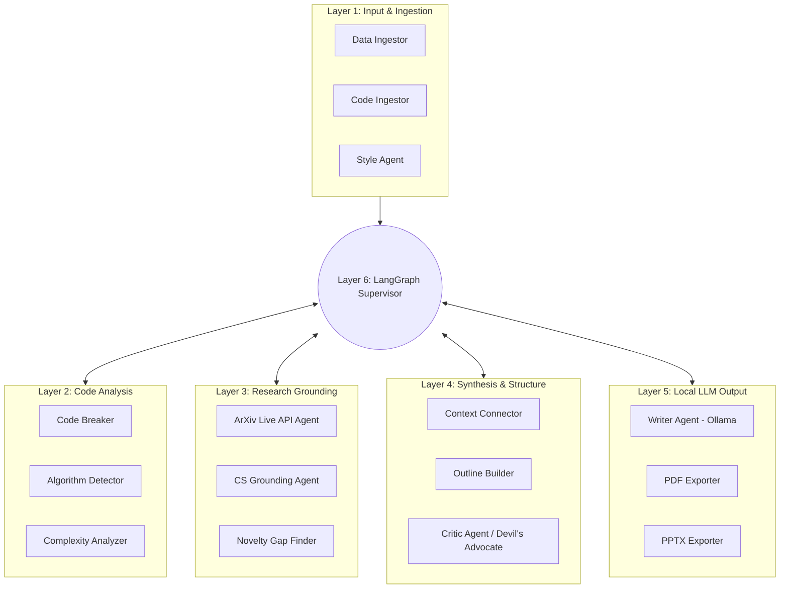

# 🔬 Autonomous Research Companion (ARC)

> **Ethical & Defensive Research Automation Framework**  
> *Transforming raw codebases and notes into structured, highly dense academic research papers, presentation decks, and BibTeX citations.*

---

## 📌 Safety & Responsible Use Banner

> [!IMPORTANT]
> **Defensive Security & Research Scope Statement**  
> This system is designed exclusively for ethical bug bounty hunting, defensive software engineering research, automated documentation, and academic analysis.  
> - **Dense Fact-Driven Analytics**: Exclusively leverages LLMs to produce concise, factual reports devoid of generic fluff.
> - **Dry-Run Mode**: Supports offline fallback execution.
> - **Zero Vulnerability Exploitation**: Analyzes code weaknesses solely for defensive remediation and academic grounding.

---

## 🏗️ 6-Layer Multi-Agent Architecture (LangGraph Powered)

Powered by **LangGraph** and a persistent **SQLite Checkpointer**, ARC coordinates a highly resilient 6-layer agent mesh:



---

## 🌟 Key Features & Recent Upgrades

1. **Ollama Local LLM Integration**: Generates deep, factual analytical reports locally using models like `llama3.1` or `qwen2.5-coder`. Automatically injects detected novelty gaps and algorithm complexities directly into the LLM synthesis prompt.
2. **Persistent Checkpointing**: Utilizes `langgraph.checkpoint.sqlite.SqliteSaver` to persist multi-agent job states safely to `checkpoints.sqlite`, preventing data loss during complex research execution.
3. **Real-time Telemetry WebSocket**: Live backend logs stream directly into a front-end "Hacker-Style" terminal UI while the agents work.
4. **Interactive Dashboards**:
   - `/`: Main interactive launcher and hacker terminal.
   - `/nn`: Live 3D Force-Graph visualization of agent topologies.
   - `/nn2d`: Interactive 2D Network graph of the agent state space.
   - `/vault`: A persistent Artifacts Vault for browsing and downloading generated PDFs and PPTXs.

---

## 📦 Project Directory Structure

```
reserch-campanion/
├── main.py                    # FastAPI Web Server Launcher
├── run_cli.py                 # Direct CLI Execution Engine
├── checkpoints.sqlite         # Persistent LangGraph Job States
├── src/                       # Core Source Code
│   ├── agents/                # 6-Layer Multi-Agent Classes
│   │   ├── layer1_input.py
│   │   ├── layer2_code.py
│   │   ├── layer3_research.py
│   │   ├── layer4_synthesis.py
│   │   ├── layer5_output.py   # Ollama LLM Synthesis integration
│   │   └── layer6_supervisor.py # LangGraph Orchestrator
│   ├── core/                  
│   │   ├── llm_client.py      # Ollama Interoperability (300s timeout logic)
│   │   └── event_bus.py       # Live WebSocket Event Emitter
│   ├── exporters/             # Document Exporters (ReportLab & PPTX)
│   └── web/                   # FastAPI Web UI Backend
│       ├── app.py             
│       └── static/            
│           ├── index.html     # Main Launcher UI
│           ├── vault.html     # Artifacts Vault
│           ├── nn.html        # 3D Agent Topology
│           └── nn_2d.html     # 2D Agent Topology
└── output/                    # Generated Deliverables
    ├── ResearchPaper.pdf
    ├── ResearchPaper.md
    └── Presentation.pptx
```

---

## 🚀 Quick Start Guide

### 1. Prerequisites & Installation

You must have [Ollama](https://ollama.com/) running locally with at least one compatible model (e.g., `ollama run llama3.1`).

```bash
# Clone the repository
cd reserch-campanion

# Install Python dependencies
pip install -r requirements.txt
```

### 2. Launching Interactive Web Dashboard

Launch the FastAPI backend with real-time WebSocket terminal log streaming:

```bash
python main.py
```

Open your browser at:  
👉 **`http://localhost:8000`**

### 3. Running via Command Line Interface (CLI)

Generate a complete paper and deck silently from the command line:

```bash
python run_cli.py \
  --topic "Distributed Asynchronous Agent Architecture" \
  --code ./sample_data/sample_code.py \
  --notes ./sample_data/sample_notes.txt \
  --output ./output
```

---

## 🛡️ License & Ethical Disclosure

Built as a defensive security research tool. Redistribution or usage must align with ethical software disclosure standards.
