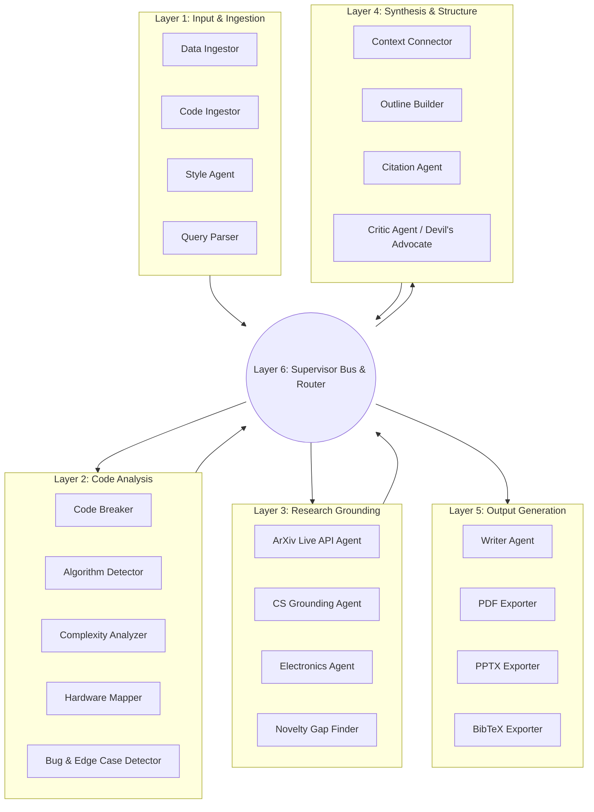

# 🔬 Autonomous Research Companion (ARC)

> **Ethical & Defensive Research Automation Framework**  
> *Transforming raw codebases and notes into structured IEEE-format research papers, presentation decks, and BibTeX citations.*

---

## 📌 Safety & Responsible Use Banner

> [!IMPORTANT]
> **Defensive Security & Research Scope Statement**  
> This system is designed exclusively for ethical bug bounty hunting, defensive software engineering research, automated documentation, and academic analysis.  
> - **Dry-Run Mode**: Supports dry-run and offline fallback execution.
> - **Rate-Limiting**: Respects API limits (e.g., ArXiv rate-limiting).
> - **Zero Vulnerability Exploitation**: Analyzes code weaknesses solely for defensive remediation and academic grounding.

---

## 🏗️ 6-Layer Multi-Agent Architecture



---

## 📦 Project Directory Structure

```
reserch-campanion/
├── main.py                    # CLI Entry Point & FastAPI Web Server Launcher
├── architecture.md            # Complete Multi-Agent Architecture Design Spec
├── README.md                  # System Documentation & Guide
├── requirements.txt           # Project Dependencies
├── sample_data/               # Test Artifacts (Sample Code & Notes)
│   ├── sample_code.py
│   └── sample_notes.txt
├── src/                       # Core Source Code
│   ├── agents/                # 6-Layer Multi-Agent Classes
│   │   ├── base_agent.py
│   │   ├── layer1_input.py
│   │   ├── layer2_code.py
│   │   ├── layer3_research.py
│   │   ├── layer4_synthesis.py
│   │   ├── layer5_output.py
│   │   └── layer6_supervisor.py
│   ├── core/                  # Core Event Bus, Models & Style Engine
│   │   ├── event_bus.py
│   │   ├── models.py
│   │   └── style_engine.py
│   ├── exporters/             # Document Exporters (ReportLab & PPTX)
│   │   ├── pdf_exporter.py
│   │   ├── pptx_exporter.py
│   │   └── bibtex_exporter.py
│   └── web/                   # FastAPI Web UI Backend & Static Frontend
│       ├── app.py
│       └── static/
│           ├── index.html
│           ├── styles.css
│           └── app.js
├── tests/                     # Unit & Integration Tests
│   └── test_pipeline.py
└── output/                    # Generated Deliverables
    ├── ResearchPaper.pdf
    ├── ResearchPaper.md
    ├── Presentation.pptx
    └── references.bib
```

---

## 🚀 Quick Start Guide

### 1. Installation

```bash
# Clone or navigate to the repository directory
cd reserch-campanion

# Install Python dependencies
pip install -r requirements.txt
```

---

### 2. Running via Command Line Interface (CLI)

Generate a complete paper and deck in one command:

```bash
python main.py \
  --topic "Distributed Asynchronous Agent Architecture" \
  --code ./sample_data/sample_code.py \
  --notes ./sample_data/sample_notes.txt \
  --output ./output
```

**Generated Deliverables in `./output/`**:
- 📄 `ResearchPaper.pdf`: Full IEEE-style formatted PDF paper.
- 📄 `ResearchPaper.md`: Raw Markdown manuscript.
- 📊 `Presentation.pptx`: 16:9 modern PowerPoint presentation deck.
- 📚 `references.bib`: BibTeX bibliography file.

---

### 3. Launching Interactive Web Dashboard

Launch the FastAPI backend with real-time WebSocket terminal log streaming:

```bash
python main.py --web --port 8000
```

Open your browser at:  
👉 **`http://localhost:8000`**

- **Interactive Inputs**: Topic, Code Files, User Notes.
- **Visual Pipeline**: Real-time stage progress indicators.
- **Log Streaming**: Live agent events pushed over WebSockets.

---

### 4. Running Automated Tests

Run the test suite to verify pipeline execution and document exporters:

```bash
python3 -m unittest discover -s tests
```

---

## 🛡️ License & Ethical Disclosure

Built as a defensive security research tool. Redistribution or usage must align with ethical software disclosure standards.
