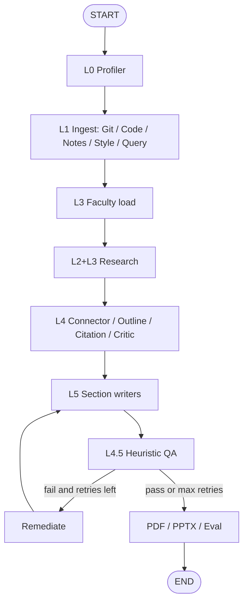

# Autonomous Research Companion (ARC)

> **Ethical & defensive research automation**  
> Turns a research topic plus optional code, notes/PDFs, or a GitHub URL into a markdown manuscript, PDF, PPTX, and BibTeX.

For implementation detail see [`architecture.md`](architecture.md).

---

## Safety & responsible use

> [!IMPORTANT]
> **Defensive research scope**  
> Built for ethical bug bounty context, defensive software research, documentation, and academic analysis.
>
> - Analyzes code for remediation and academic grounding — not exploitation.
> - ArXiv failures return an empty citation list (no fabricated papers).
> - Layer 4.5 QA scores are **local heuristics**, not commercial plagiarism/AI detectors.
> - Bind the dashboard only on trusted networks; uploads and Layer 0 can execute Python in a subprocess sandbox.

---

## Architecture (LangGraph)

Powered by **LangGraph** with a **SQLite checkpointer** (`checkpoints.sqlite`). Shared state is `PipelineContext`.



| Layer | Role |
|------|------|
| **0** | Subprocess sandbox profiler for uploaded `.py` (timeout; not in-process `exec`) |
| **1** | Git clone, code/notes ingest, style fingerprint, query parse |
| **2** | AST / heuristic code analysis (skipped or light in some job modes) |
| **3** | ArXiv, DuckDuckGo web search, skill-driven research, faculty JSON |
| **4** | Unified context, outline, citations, pre-write critic |
| **4.5** | Local n-gram / style / peer / format / fact heuristics after writing |
| **5** | Section writers + PDF / PPTX / BibTeX exporters |
| **6** | LangGraph supervisor + event bus + checkpoints |
| **7** | FastAPI dashboard (`src/web/dashboard.py`) |

**Critical rule:** QA runs **after** the writer. The remediator cannot force-approve; scores are recomputed on the next QA pass (max 2 remediation loops).

### LLM policy

| Role | Backend |
|------|---------|
| Non-writing agents | Local Ollama (`ARC_LOCAL_MODEL`, default `llama3.1:latest`) |
| Layer 5 writing | Optional Mistral cloud when `CLOUD_LLM_API_KEY` is set (`ARC_WRITING_USE_CLOUD=1` by default) |
| Writing fallback | Local Ollama if cloud is missing or disabled |

Skills load as **prompt text** from Claude-plugin `SKILL.md` trees (preferred) or flat `src/skills/*.md`. Plugin helper scripts / MCP / grill-me are **not** executed by LangGraph.

---

## Key features

- **Job modes:** `full_paper`, `literature_review`, `research_only`, `complete_draft`
- **Inputs:** topic, code/notes upload, GitHub URL, optional draft text
- **Writer modes:** multi-section writers or single writer
- **Live telemetry:** WebSocket agent logs, progress %, job history
- **Artifacts:** `{job_id}_ResearchPaper.pdf`, `{job_id}_Presentation.pptx`, `references.bib`
- **Checkpoint / resume:** LangGraph `SqliteSaver`; job metadata in SQLite
- **Optional humanizer:** GPT-2 perplexity extras via `requirements-humanizer.txt`

### QA limitations

ARC QA values are local heuristic estimates, not externally validated scores:

- Corpus-overlap compares n-grams against pipeline context — not a plagiarism database.
- AI-style uses buzzword / passive-voice signals — not an authorship verdict.
- Fact checking compares selected stats to collected context — not claim verification.

Use independent plagiarism, authorship, and fact-verification services for publication or compliance.

---

## Project layout

```
reserch-campanion/
├── main.py                 # CLI pipeline (+ --web → legacy src.web.app)
├── run_cli.py              # Alternate CLI entry
├── run_job.py              # Demo / headless job helper
├── architecture.md         # Honest architecture notes
├── requirements.txt
├── requirements-humanizer.txt   # Optional torch/transformers
├── sample_data/
├── src/
│   ├── agents/             # layer0 … layer6 (+ layer4_5_qa)
│   ├── core/               # models, llm_client, skills_loader, database, bus
│   ├── exporters/          # PDF, PPTX, BibTeX
│   ├── skills/             # Flat prompts + Claude-plugin skill trees
│   └── web/
│       ├── dashboard.py    # Primary control-center UI/API (recommended)
│       ├── app.py          # Legacy static UI (nn / vault / index)
│       └── static/
└── output/                 # Job uploads + generated deliverables
```

---

## Quick start

### 1. Prerequisites

- Python 3.10+
- [Ollama](https://ollama.com/) with a chat model, e.g. `ollama pull llama3.1`
- Optional: `CLOUD_LLM_API_KEY` for cloud writing

```bash
cd reserch-campanion
python -m venv .venv
source .venv/bin/activate   # Windows: .venv\Scripts\activate
pip install -r requirements.txt
# Optional: local GPT-2 perplexity for HumanizerPipeline
pip install -r requirements-humanizer.txt
```

### 2. Environment (optional `.env`)

| Variable | Purpose |
|----------|---------|
| `OLLAMA_BASE_URL` | Default `http://localhost:11434` |
| `ARC_LOCAL_MODEL` | Default `llama3.1:latest` |
| `CLOUD_LLM_API_KEY` | Enables Layer 5 cloud writing |
| `ARC_WRITING_USE_CLOUD` | `1` (default) / `0` to force local writing |
| `ARC_WRITING_MODEL` | Default `mistral-large-latest` |

### 3. Launch the dashboard (recommended)

```bash
PYTHONPATH=$(pwd) uvicorn src.web.dashboard:app --host 127.0.0.1 --port 8000 --reload
```

Open **http://127.0.0.1:8000**

Legacy UI (static `index` / `vault` / `nn`):

```bash
python main.py --web --port 8000
```

### 4. CLI pipeline

```bash
PYTHONPATH=$(pwd) python main.py \
  --topic "Distributed Asynchronous Agent Architecture" \
  --code ./sample_data/sample_code.py \
  --notes ./sample_data/sample_notes.txt \
  --out ./output
```

Outputs land under `./output/` as `{job_id}_ResearchPaper.pdf` and `{job_id}_Presentation.pptx`.

### 5. Tests

```bash
PYTHONPATH=$(pwd) python -m unittest discover -s tests -v
```

---

## Security notes

- Prefer binding to `127.0.0.1` unless you add authentication.
- Layer 0 runs uploaded `.py` in a short-lived subprocess — treat uploads as untrusted.
- Git ingest clones user-provided URLs; use only trusted repos.
- Keep secrets in environment / `.env` (gitignored); never commit API keys.

---

## License & ethics

Built as a defensive research tool. Redistribution and use should follow ethical disclosure and academic integrity standards.
