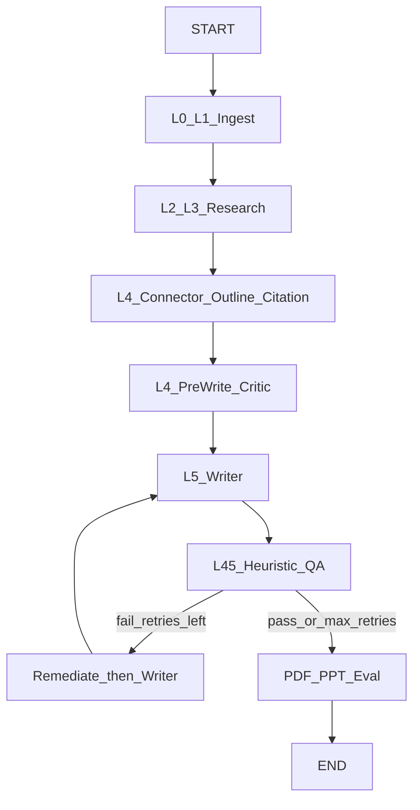

# Autonomous Research Companion (ARC) — Architecture

## Overview
ARC is a **LangGraph-orchestrated multi-agent pipeline** that turns source code, notes/PDFs, and a research topic into a markdown manuscript, PDF, PPTX, and BibTeX. Quality scores are **local heuristics (approximate)** — not commercial plagiarism/AI detectors.

## Pipeline (actual graph order)

**Critical rule:** Layer 4.5 QA runs **after** the Writer, on `markdown_manuscript`. Remediator rewrites text only and **cannot force-approve**; scores are recomputed on the next QA pass (max 2 remediation loops).

## Layers

### Layer 0 — Sandbox Profiler
- Runs `.py` inputs in a **subprocess** with timeout (not in-process `exec`).

### Layer 1 — Input & Parsing
- Git / Code / Data ingestors, Style fingerprint (`~/.arc_style_profile.json`), Query parser.

### Layer 2 — Code Analysis
- Code Breaker (AST + optional Chroma), Algo Detector, Complexity, HW Mapper, Bug & Edge Case.

### Layer 3 — Research & Grounding
- ArXiv (live API; **empty list on failure — no fabricated citations**), Web search (DuckDuckGo), CS / Electronics / Literature / Gap Finder.
- Faculty profiles loaded by **FacultyProfileAgent** LangGraph node (`query → faculty → research`) from `./output/faculty_profiles/*.json` when present (pre-step: `process_faculty` / OpenAlex fetch). Does not invent profiles.
- Flat skills: `general_research`, `litreview`, `deep_research`, plus `interdisciplinary_faculty` addendum when faculty JSON exists.

### Layer 4 — Synthesis
- Connector merges arxiv + code + cs + electronics + literature + web + faculty into `unified_context`.
- Outline sections align with Writer skill keys (Abstract, Introduction, Literature Review, Methodology, System Architecture, Algorithm, Results, Discussion, Conclusion).
- Citation agent formats real ArXiv items only.
- Pre-write Critic scores structure before drafting.

### Layer 4.5 — Heuristic QA (approximate)
- Plagiarism: local 5-gram overlap vs notes/arxiv (`method=local_ngram_heuristic`).
- AI-style: buzzword/passive heuristics (`method=local_style_heuristic`).
- Peer review / format / fact-check: require manuscript; fail closed if empty.
- Dashboard labels these as **Heuristic QA (approximate)**.

### Layer 5 — Output
- Writer drafts sections via flat skills; optional Mistral cloud when `CLOUD_LLM_API_KEY` is set; else local Ollama (`llama3.1:latest`).
- PDF exporter renders **`markdown_manuscript`** (metrics appendix optional).
- Artifacts: `{job_id}_ResearchPaper.pdf`, `{job_id}_Presentation.pptx`.

### Layer 6 — Supervisor
- LangGraph + **SqliteSaver** checkpointer (not MemorySaver).
- HITL `interrupt_before` is **not** enabled by default; resume via `resume_pipeline(thread_id)`.
- Agent traces logged for heuristic upskill eval (fails if no manuscript/traces).
- Context metrics stub for logging (not a Mamba/Transformer model).

### Layer 7 — Dashboard
- FastAPI UI/API; downloads resolve `{job_id}_*` filenames.

## LLM stack (honest)
| Role | Model / API |
|------|-------------|
| All non-writing agents | **Local only** — Ollama `ARC_LOCAL_MODEL` / `llama3.1:latest` |
| Layer 5 section **writing** | Mistral cloud when `CLOUD_LLM_API_KEY` set (`ARC_WRITING_USE_CLOUD=1` default) |
| Writing fallback | Local LLM if cloud missing/disabled |
| Optional local coding fallback | `qwen2.5-coder:7b` on Ollama error |

## Skills wiring

| Wired into Python agents | Source |
|--------------------------|--------|
| Claude-plugin `SKILL.md` (**preferred**) | `PLUGIN_SKILL_MAP` in `src/core/skills_loader.py` |
| Flat prompts (fallback) | `src/skills/*.md` |
| Section writers | abstract, introduction, literature_review, methodology, system_architecture, algorithm, results, discussion, conclusion, critic, generic |
| L3 protocols | litreview, deep_research, research (+ topic routing: patent, grants, dossier, clinical, market, …) |
| Faculty addendum | interdisciplinary_faculty (flat) when faculty JSON present |

### Do Claude plugin skills work on local LLM?
| Piece | On Ollama/local? |
|-------|------------------|
| `SKILL.md` as system prompt | **Yes** (truncated + ARC runtime adapter) |
| Claude Code MCP / bash_tool / grill-me | **No** — Claude Code only |
| Plugin helper scripts | Only if run separately; ARC does not auto-exec |
| Search in ARC | Python agents (ArXiv/DDG) + local LLM following skill text |

| Not auto-executed by LangGraph | Notes |
|-------------------------------|-------|
| `skills/*/scripts/` | Optional CLI helpers |
| `.claude-plugin/` agents/commands | Claude Code only |

## Persistence
- Job/trace store: SQLite (`src/core/database.py`), checkpoints: `checkpoints.sqlite`.

## Out of scope (by design)
- Commercial plagiarism/AI APIs
- Real Mamba/Transformer neural engines
- Auto-executing Claude Code MCP/grill-me/docx packaging inside LangGraph
