# Autonomous Research Companion — System Architecture

## Overview
The Autonomous Research Companion is a 6-layer multi-agent system designed to transform raw code, unstructured notes/PDFs, and high-level research topics into fully-formatted research papers (PDF) and presentations (PPTX).

---

## Architecture Flowchart

```mermaid
flowchart TD
    %% Define Styles
    classDef supervisor fill:#8e44ad,stroke:#5b2c6f,color:white,stroke-width:4px;
    classDef l1 fill:#3498db,stroke:#2980b9,color:white;
    classDef l2 fill:#e74c3c,stroke:#c0392b,color:white;
    classDef l3 fill:#2ecc71,stroke:#27ae60,color:white;
    classDef l4 fill:#f39c12,stroke:#d68910,color:white;
    classDef l45 fill:#d35400,stroke:#a04000,color:white;
    classDef l5 fill:#34495e,stroke:#2c3e50,color:white;
    classDef io fill:#95a5a6,stroke:#7f8c8d,color:black,stroke-dasharray: 5 5;
    
    %% Inputs (User Data)
    subgraph IODisks [User Input Sources]
        direction LR
        RawCode[(Raw Source Code)]:::io
        RawNotes[(PDFs & User Notes)]:::io
        RawTopic[(Topic String)]:::io
    end
    
    %% Central Hub / Brain (Event Bus)
    Sup((Layer 6: Supervisor Agent\nCentral Event Bus & Router)):::supervisor

    %% LAYER 1: INPUT & PARSING
    subgraph Layer1 [Layer 1: Input & Parsing]
        direction LR
        GI(Git Ingestor):::l1
        CI(Code Ingestor):::l1
        DI(Data Ingestor):::l1
        SA(Style Agent):::l1
        QP(Query Parser):::l1
    end
    
    %% LAYER 2: CODE ANALYSIS
    subgraph Layer2 [Layer 2: Code Analysis]
        direction LR
        CB(Code Breaker):::l2
        AD(Algo Detector):::l2
        CA(Complexity Analyzer):::l2
        HM(HW Mapper):::l2
        BE(Bug & Edge Case):::l2
    end
    
    %% LAYER 3: RESEARCH & GROUNDING
    subgraph Layer3 [Layer 3: Research & Grounding]
        direction LR
        WSA(Web Search):::l3
        AA(ArXiv Agent):::l3
        CSA(CS Agent):::l3
        EA(Electronics Agent):::l3
        LA(Literature Agent):::l3
        GF(Gap Finder):::l3
    end
    
    %% LAYER 4: SYNTHESIS & STRUCTURE
    subgraph Layer4 [Layer 4: Synthesis & Structure]
        direction LR
        Conn(Connector):::l4
        OB(Outline Builder):::l4
        Cit(Citation Agent):::l4
        Crit(Critic Agent):::l4
    end

    %% LAYER 4.5: QUALITY AUDIT & PEER REVIEW
    subgraph Layer45 [Layer 4.5: Quality Audit & Peer Review]
        direction LR
        PC(Plagiarism Checker):::l45
        PR(Plagiarism Remediator):::l45
        AI(AI Percentage Auditor):::l45
        PRV(Peer Reviewer Agent):::l45
        FQA(Format Quality Auditor):::l45
    end
    
    %% LAYER 5: OUTPUT GENERATION
    subgraph Layer5 [Layer 5: Output Generation]
        direction LR
        WA(Writer Agent):::l5
        PDF(PDF Exporter):::l5
        PPT(PPT Exporter):::l5
    end
    
    %% Outputs (Deliverables)
    subgraph Deliverables [Final Export]
        direction LR
        OutPDF[(ResearchPaper.pdf)]:::io
        OutPPT[(Presentation.pptx)]:::io
        OutBIB[(References.bib)]:::io
    end

    %% --- FULLY CONNECTED WIRES & DATA FLOW ---

    %% 1. Input Source Wires -> Layer 1 Agents
    RawCode -->|"Raw Files"| CI
    RawNotes -->|"Text & Metadata"| DI
    RawNotes -->|"Style Samples"| SA
    RawTopic -->|"Topic String"| QP

    %% 2. Layer 1 -> Layer 2 & 3 Wires
    CI -->|"AST Trees & Tokens"| CB & AD & CA & HM & BE
    DI -->|"Parsed JSON Notes"| LA
    QP -->|"Sub-queries"| AA & CSA & EA
    SA -->|"Style Fingerprint"| WA

    %% 3. Layer 2 Code Analysis Wires -> Layer 3 & 4
    CB -->|"Function Blocks"| AA
    AD -->|"Algorithm Types"| CSA
    CA -->|"Big-O Metrics"| Conn
    HM -->|"Hardware Specs"| EA
    BE -->|"Code Weaknesses"| GF

    %% 4. Layer 3 Research Wires -> Layer 4 Synthesis
    AA -->|"BibTeX & Papers"| Cit & Conn
    CSA -->|"CS Benchmarks"| Conn
    EA -->|"Circuit Specs"| Conn
    LA -->|"Background Knowledge"| Conn
    GF -->|"Identified Research Gaps"| OB

    %% 5. Layer 4 Synthesis Wires -> Layer 5 Writer
    Conn -->|"Unified Context"| WA
    OB -->|"Section Outlines"| WA
    Cit -->|"IEEE/ACM References"| WA
    WA <-->|"Draft Review & Feedback"| Crit

    %% 6. Layer 5 Writer -> Layer 4.5 Quality Audit Wires
    WA -->|"Draft Manuscript"| PC & AI & PRV & FQA

    %% 7. Layer 4.5 Self-Healing Feedback Loop Wires
    PC -.->|"Similarity > 15%"| PR
    AI -.->|"AI Score > 10%"| PR
    PR -.->|"Re-synthesized Text"| WA
    PRV -.->|"Reviewer Questions"| OB
    FQA -.->|"Grammar Fixes"| WA

    %% 8. Approved QA -> Exporters & Deliverables
    PC & AI & PRV & FQA -->|"Quality Approved"| PDF & PPT & Cit
    PDF -->|"Rendered PDF"| OutPDF
    PPT -->|"Rendered Deck"| OutPPT
    Cit -->|"BibTeX Export"| OutBIB

    %% 9. Layer 6 Supervisor Event Bus Monitoring (All Agents)
    Sup <.-> GI & CI & DI & SA & QP
    Sup <.-> CB & AD & CA & HM & BE
    Sup <.-> WSA & AA & CSA & EA & LA & GF
    Sup <.-> Conn & OB & Cit & Crit
    Sup <.-> PC & PR & AI & PRV & FQA
    Sup <.-> WA & PDF & PPT
```

---

## Layer Breakdown

### Layer 6: LangGraph Neural Orchestrator (`SupervisorAgent`)
- **StateGraph & MemorySaver**: Manages the overarching `ResearchState` utilizing LangGraph. Enables thread-level checkpointing for fault-tolerance, dynamic conditional routing (self-healing), and Human-in-the-Loop (HITL) pause-resume execution.
- **Asynchronous Execution**: Executes Layer 2 and Layer 3 research agents simultaneously via `asyncio.gather` for maximum throughput.

### Layer 1: Input & Parsing (5 Agents)
- **Git Ingestor (`GI`)**, **Code Ingestor (`CI`)**, **Data Ingestor (`DI`)**, **Query Parser (`QP`)**.
- **Style Agent (`SA`)**: Learns and persists the user's exact writing style and tone into a JSON fingerprint (`~/.arc_style_profile.json`), ensuring consistent, non-AI-like tone across sessions.

### Layer 2: Code Analysis (5 Agents)
- **Code Breaker (`CB`)**: Deconstructs raw files into an AST-based Call Graph and embeds every function snippet into a **Local ChromaDB Vector Store** (`~/.arc_code_chroma`). This creates a Graph RAG mapping, preventing context loss, reducing LLM token costs, and dramatically accelerating code understanding.
- **Algo Detector (`AD`)**, **Complexity Analyzer (`CA`)**, **HW Mapper (`HM`)**, **Bug & Edge Case (`BE`)**.

### Layer 3: Research & Grounding (6 Agents)
- **Web Search Agent (`WSA`)**: Live web intelligence utilizing DuckDuckGo (`ddgs`) without requiring API keys.
- **ArXiv Agent (`AA`)**: Fetches full-text PDFs using PyMuPDF and utilizes a **ChromaDB Semantic Vector Cache** (`~/.arc_arxiv_chroma`) to instantly bypass redundant API calls based on cosine similarity of search vectors.
- **CS Agent (`CSA`)**, **Electronics Agent (`EA`)**, **Literature Agent (`LA`)**, **Gap Finder (`GF`)**.

### Layer 4: Synthesis & Structure (4 Agents)
- **Connector (`Conn`)**, **Outline Builder (`OB`)**, **Citation Agent (`Cit`)**, **Critic Agent (`Crit`)**.

### Layer 4.5: Quality Audit & Peer Reviewer (5 Agents)
- **Plagiarism Checker (`PC`)**: Similarity monitor (<15%).
- **Plagiarism Remediator (`PR`)**: Reasoning-driven re-synthesis engine.
- **AI Percentage Auditor (`AI`)**: AI footprint auditor (<10%).
- **Peer Reviewer Agent (`PRV`)**: Evaluates 7 core journal submission questions.
- **Format Quality Auditor (`FQA`)**: Grammar, terminology, and acronym auditor.

### Layer 5: Output Generation (3 Agents)
- **Writer Agent (`WA`)**, **PDF Agent (`PDF`)**, **PPT Agent (`PPT`)**.

### Hugging Face Upskill Integration Engine (`src/core/upskill_engine.py`)
- **AgentTraceLogger**: Captures full execution traces, inputs, outputs, and timestamps across all 27 agents.
- **SkillEvaluator**: Evaluates multi-agent accuracy across 4 academic dimensions (`academic_accuracy`, `citation_grounding`, `structural_coherence`, `reproducibility_score`) ensuring overall accuracy score >= 90.0%.

### Local LLM Engine & Ollama Connector (`src/core/llm_client.py`)
- **Privacy-First Offline Execution**: Full inference stack runs locally without relying on external cloud APIs, ensuring absolute privacy for proprietary codebases.
- **Dual-Model Specialization**:
  - **DeepSeek-R1 (Reasoning)**: Highly optimized for logical deduction, algorithmic complexity analysis, and multi-step synthesis.
  - **Qwen2.5-Coder (Coding)**: Specializes in AST parsing, bug detection, and semantic code context understanding.
- **Hardware Optimization**: Uses localized 7B models for rapid intermediate agent tasks, while escalating heavy academic synthesis to high-parameter Cloud APIs (e.g., Mistral Large) for maximum density and quality.
### Hybrid Mamba-Transformer Neural Engine (`src/core/hybrid_engine.py`)
- **Mamba Linear Scanner (`MambaLinearScanner`)**: $O(N)$ state-space model for rapid ingestion of large codebases and multi-page PDF notes.
- **Transformer Attention Synthesizer (`TransformerAttentionSynthesizer`)**: Dense self-attention QKV engine connecting AST nodes to ArXiv citations.
### Layer 0: Sandbox Runtime & Profiler (`src/agents/layer0_profiler.py`)
- **Runtime Profiler Agent (`RPA`)**: Executes raw python code in an isolated sandbox runtime to measure true CPU execution time (`cpu_time_ms`), peak memory footprint (`peak_memory_mb`), and throughput (`throughput_ops_sec`).

### SQLite Database Persistence Engine (`src/core/database.py`)
- **Durable Job Store (`db.sqlite3`)**: Persists job statuses, agent trace histories, quality audit scores, and output file locations across system reboots.

### Layer 7: Real-Time Web Dashboard & REST API (`src/web/dashboard.py`)
- **FastAPI Control Center**: Interactive HTML5 dashboard with live 27-agent neural event log stream, job progress metrics, downloadable PDF research papers, and PPTX decks.

