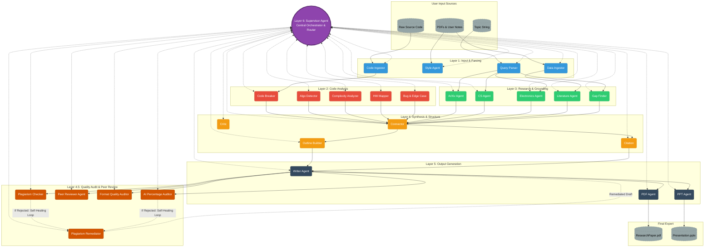

# Autonomous Research Companion — System Architecture

## Overview
The Autonomous Research Companion is a 6-layer multi-agent system designed to transform raw code, unstructured notes/PDFs, and high-level research topics into fully-formatted research papers (PDF) and presentations (PPTX).

---

## Architecture Flowchart

---

## Layer Breakdown

### Layer 6: Central Orchestrator & Router (`SupervisorAgent`)
- Monitors state and routes data between layers asynchronously.

### Layer 1: Input & Parsing (4 Agents)
- **Code Ingestor (`CI`)**, **Data Ingestor (`DI`)**, **Style Agent (`SA`)**, **Query Parser (`QP`)**.

### Layer 2: Code Analysis (5 Agents)
- **Code Breaker (`CB`)**, **Algo Detector (`AD`)**, **Complexity Analyzer (`CA`)**, **HW Mapper (`HM`)**, **Bug & Edge Case (`BE`)**.

### Layer 3: Research & Grounding (5 Agents)
- **ArXiv Agent (`AA`)**, **CS Agent (`CSA`)**, **Electronics Agent (`EA`)**, **Literature Agent (`LA`)**, **Gap Finder (`GF`)**.

### Layer 4: Synthesis & Structure (4 Agents)
- **Connector (`Conn`)**, **Outline Builder (`OB`)**, **Citation Agent (`Cit`)**, **Critic Agent (`Crit`)**.

### Layer 4.5: Quality Audit & Peer Reviewer (5 Agents)
- **Plagiarism Checker (`PC`)**: Similarity monitor (<15%).
- **Plagiarism Remediator (`PR`)**: Reasoning-driven re-synthesis engine.
- **AI Percentage Auditor (`AI`)**: AI footprint auditor (<10%).
- **Peer Reviewer Agent (`PRV`)**: Evaluates 7 core journal submission questions.
- **Format Quality Auditor (`FQA`)**: Grammar, terminology, and acronym auditor.

### Layer 5: Output Generation (3 Agents)
- **Writer Agent (`WA`)**, **PDF Agent (`PDF`)**, **PPT Agent (`PPT`)**.

