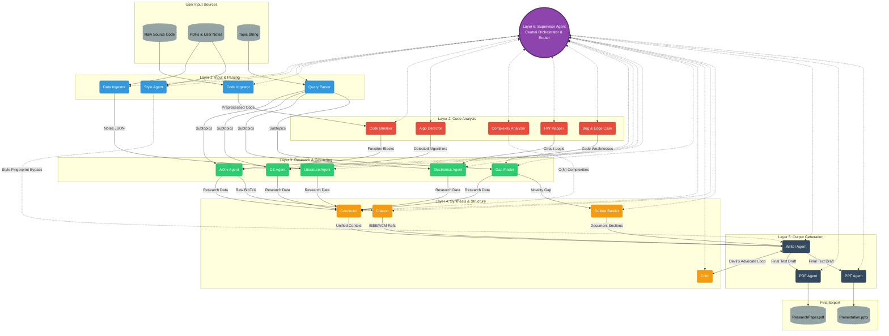

# Autonomous Research Companion — System Architecture

## Overview
The Autonomous Research Companion is a 6-layer multi-agent system designed to transform raw code, unstructured notes/PDFs, and high-level research topics into fully-formatted research papers (PDF) and presentations (PPTX).

---

## Architecture Flowchart

---

## Layer Breakdown

### Layer 6: Central Orchestrator & Router (Supervisor Agent)
- **Role**: Serves as the system brain and event bus (NATS-compatible).
- **Function**: Continuously monitors state and routes data between layers asynchronously.

### Layer 1: Input & Parsing
- **Code Ingestor (`CI`)**: Parses raw source code.
- **Data Ingestor (`DI`)**: Extracts structured text and metadata from PDFs and user notes.
- **Style Agent (`SA`)**: Captures user writing style fingerprints.
- **Query Parser (`QP`)**: Deconstructs raw topics into targeted sub-queries.

### Layer 2: Code Analysis
- **Code Breaker (`CB`)**: Breaks code into function blocks.
- **Algo Detector (`AD`)**: Identifies core algorithms and techniques.
- **Complexity Analyzer (`CA`)**: Calculates Big-O space/time complexity.
- **HW Mapper (`HM`)**: Maps hardware and circuit abstractions.
- **Bug & Edge Case (`BE`)**: Spots code weaknesses and edge conditions.

### Layer 3: Research & Grounding
- **ArXiv Agent (`AA`)**: Fetches academic literature and BibTeX citations.
- **CS Agent (`CSA`)**: Researches Computer Science fundamentals and state-of-the-art benchmarks.
- **Electronics Agent (`EA`)**: Explores hardware/electronics domain knowledge.
- **Literature Agent (`LA`)**: Analyzes notes and background material.
- **Gap Finder (`GF`)**: Identifies novel gaps between code weaknesses and existing literature.

### Layer 4: Synthesis & Structure
- **Connector (`Conn`)**: Synthesizes unified context across research and code analysis.
- **Outline Builder (`OB`)**: Constructs paper/presentation sections based on novelty gaps.
- **Citation Agent (`Cit`)**: Formats BibTeX references into IEEE/ACM styles.
- **Critic Agent (`Crit`)**: Performs iterative "Devil's Advocate" reviews on writer drafts.

### Layer 5: Output Generation
- **Writer Agent (`WA`)**: Drafts main text using styled fingerprint guidelines.
- **PDF Agent (`PDF`)**: Compiles final manuscript into `ResearchPaper.pdf`.
- **PPT Agent (`PPT`)**: Generates structured slides into `Presentation.pptx`.
