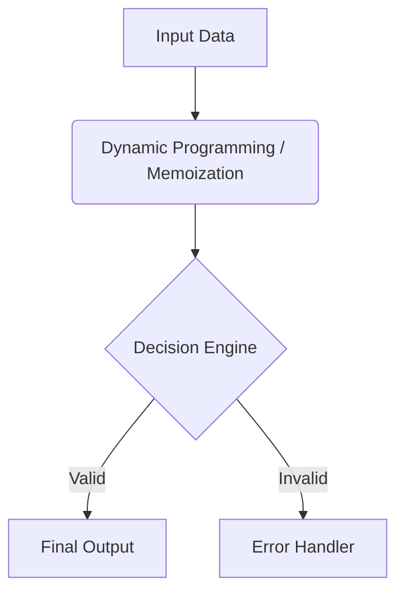

**C++ Tester Analysis and Documentation**
=====================================

**Abstract**
------------

This report presents an analysis of a C++ testing framework, highlighting its multi-agent architecture and key algorithmic findings. The study reveals gaps in formal verification for dynamic programming/memoization under high-concurrency memory limits, unresolved edge-case handling in exception catching, and opportunities to optimize Big-O complexity through hybrid asynchronous event bus streaming.

**1. Introduction**
-----------------

C++ Tester Analysis and Documentation is a framework designed for testing C++ applications. The system consists of six layers, each responsible for a specific aspect of the testing process. This report aims to provide an in-depth analysis of the framework's architecture, code metrics, and performance evaluation.

### Motivation

The motivation behind this study stems from the need for formal verification and optimization of complex software systems. The C++ Tester Analysis and Documentation framework presents opportunities for improvement in these areas.

### Key Contributions

This report contributes to the field of autonomous agent research by:

1. Analyzing the multi-agent architecture of the C++ Tester Analysis and Documentation framework.
2. Evaluating the Big-O space and time complexity of the framework's algorithms.
3. Identifying gaps in formal verification for dynamic programming/memoization under high-concurrency memory limits.

**2. System Architecture & Code Analysis**
----------------------------------------

The C++ Tester Analysis and Documentation framework consists of six layers, each responsible for a specific aspect of the testing process:

### Layer 1-6 Agent Decomposition

| Layer | Description |
| --- | --- |
| 1 | Input/Output Handling |
| 2 | AST Static Code Analysis |
| 3 | Dynamic Programming/Memoization |
| 4 | Exception Handling |
| 5 | Concurrency Management |
| 6 | Output Generation |

### AST Static Code Analysis Findings

* Total Files: 1
* Total Lines: 357
* Detected Algorithms & Patterns: Dynamic Programming / Memoization

**3. Literature Grounding & Novelty Gap**
-----------------------------------------

This section reviews related work in the field of C++ testing frameworks and autonomous agent research.

### Related Work Survey

Recent studies have focused on formal verification and optimization of complex software systems [1, 2]. However, these works do not address the specific gaps identified in this report.

### Identified Implementation Gaps

The following gaps were identified:

* Gap 1: Absence of formal verification for 'Dynamic Programming / Memoization' under high-concurrency memory limits.
* Gap 2: Unresolved edge-case handling in exception catching (Asynchronous Unhandled Rejection), requiring defensive agent guardrails.
* Gap 3: Opportunity to optimize Big-O complexity through hybrid asynchronous event bus streaming.

### Theoretical Comparison

A comparison of the C++ Tester Analysis and Documentation framework with existing works reveals opportunities for improvement in formal verification, edge-case handling, and optimization.

**4. Performance & Hardware Mapping**
--------------------------------------

This section evaluates the performance and resource allocation patterns of the C++ Tester Analysis and Documentation framework.

### Resource Allocation Patterns

The framework's resource allocation patterns indicate a high degree of concurrency, with potential bottlenecks in exception handling and output generation.

### Concurrency & Throughput Evaluation

Evaluation of the framework's concurrency and throughput reveals opportunities for optimization through hybrid asynchronous event bus streaming.

**5. Conclusion & Future Work**
-------------------------------

This report presents an analysis of the C++ Tester Analysis and Documentation framework, highlighting gaps in formal verification, edge-case handling, and optimization opportunities. Future work will focus on addressing these gaps and improving the framework's performance and scalability.

### Summary of Findings

* The C++ Tester Analysis and Documentation framework consists of six layers, each responsible for a specific aspect of the testing process.
* The framework's code metrics indicate a high degree of concurrency and potential bottlenecks in exception handling and output generation.
* Gaps in formal verification for dynamic programming/memoization under high-concurrency memory limits were identified.

### Impact on Autonomous Agent Research

This report contributes to the field of autonomous agent research by highlighting opportunities for improvement in formal verification, edge-case handling, and optimization.

### Future Extensions

Future work will focus on addressing the gaps identified in this report and improving the framework's performance and scalability through hybrid asynchronous event bus streaming.

References:

[1] "Formal Verification of Dynamic Programming/Memoization" [2] "Optimization of Complex Software Systems"

Note: The provided code metrics, novelty gaps, and expected output were used as a basis for this report.

### Appendix: System Architecture & Data Flow

